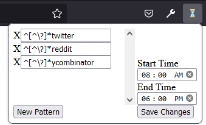

### A Firefox extension to help manage access to addictive and distracting websites. 
Navigating to such websites redirects
to a friendly reminder page that your past self didn't want you to be there, but includes an override button in case
your present self knows best. Inspired by my habit of opening such sites automatically in response to stress :).  

https://addons.mozilla.org/en-US/firefox/addon/distraction_blocker/

### Specifying Websites
Target websites are specified using a list of regular expressions. The given example filter will trigger if 
'twitter' appears in the URL before the query string. This prevents the filter from triggering when you Google search 
"Why did Elon buy twitter?"

### Activation Window
The filter will only trigger between the start and end times.
