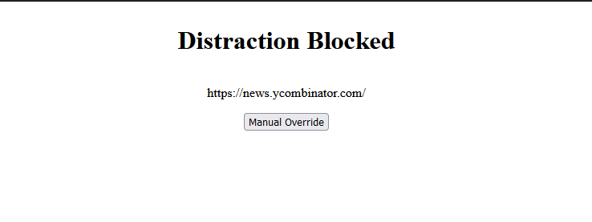

### A Firefox extension to help manage access to addictive and distracting websites. 
Navigating to such websites redirects
to a friendly reminder page that your past self didn't want you to be there, but includes an override button in case
your present self knows best.

### Specifying Websites
Target websites are specified using a list of regular expressions. The given example the filter will trigger if 
'twitter' appears in the URL before the query string. This prevents the filter from triggering 
